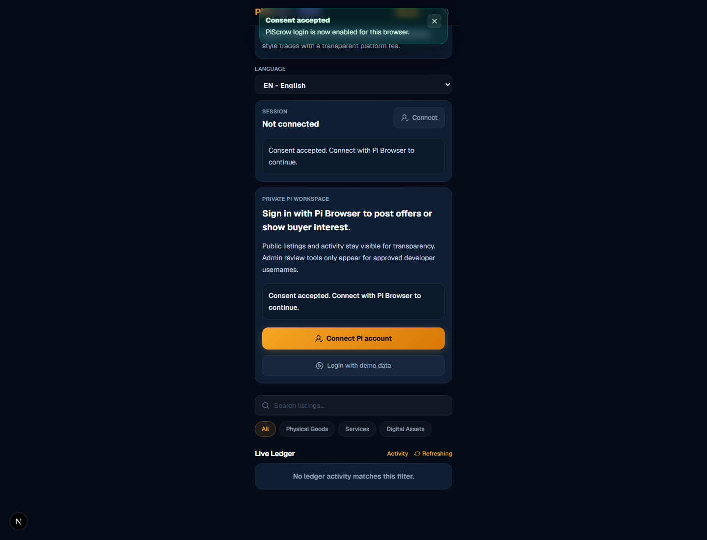
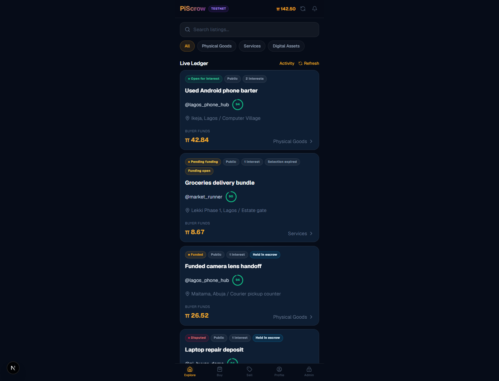
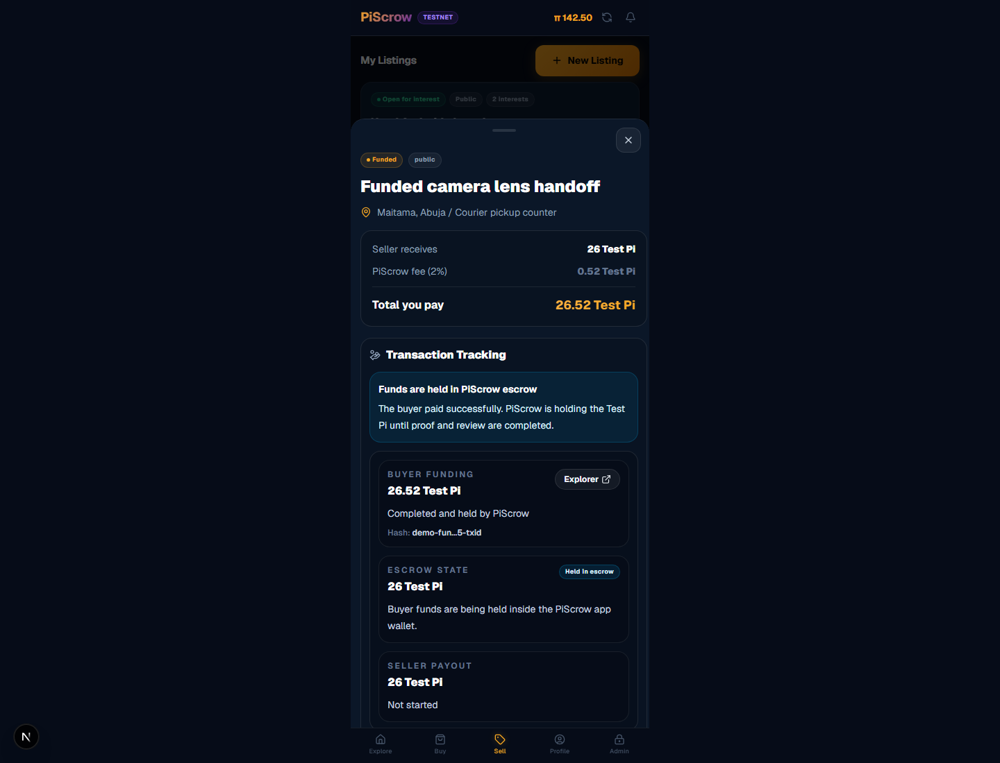
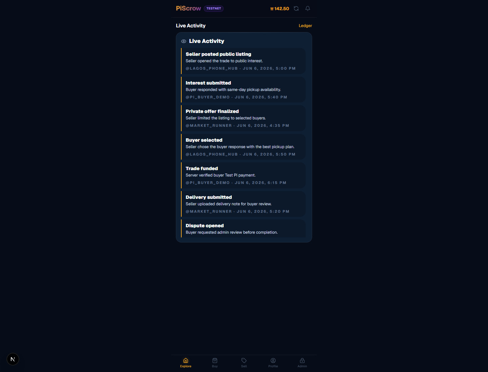
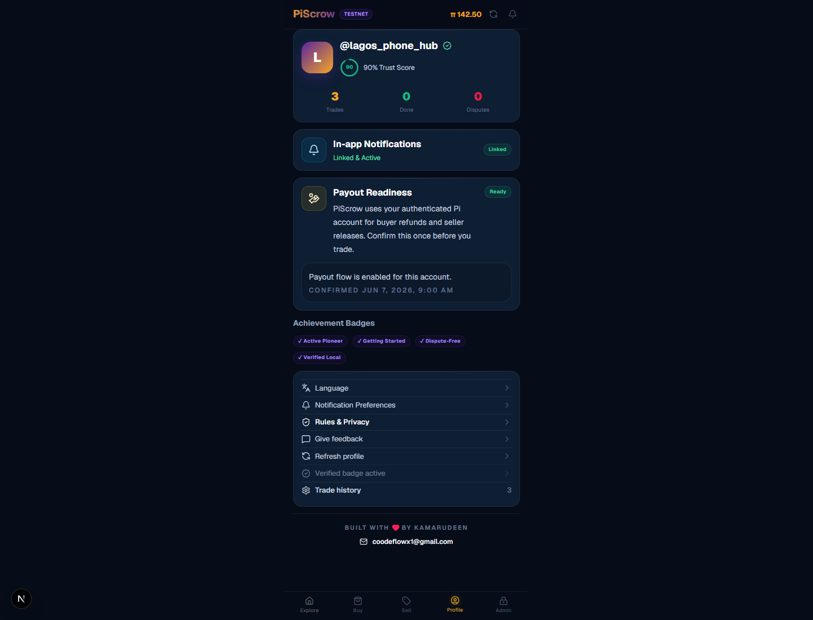
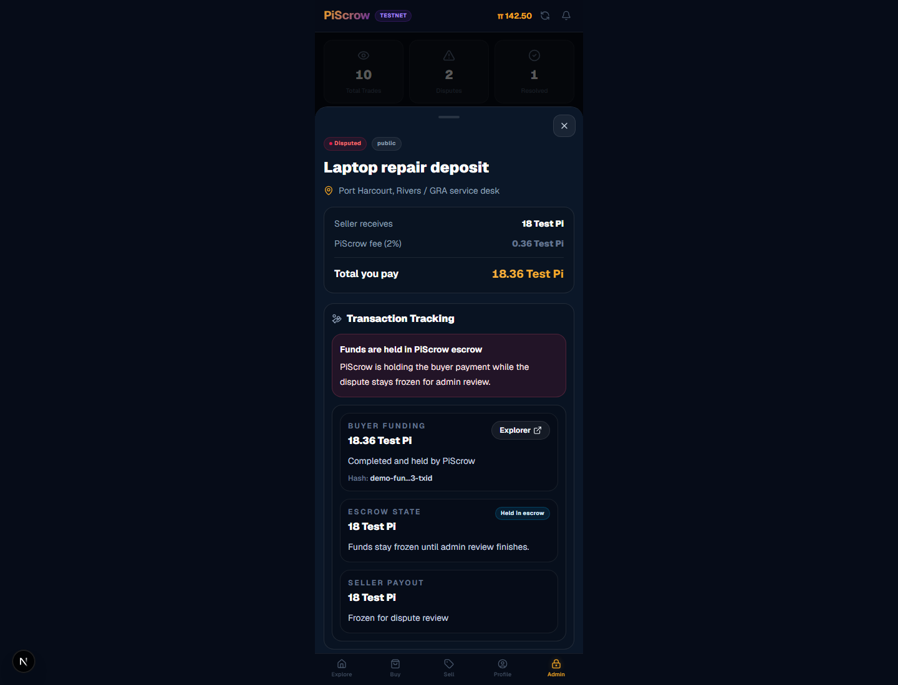

# PiScrow

PiScrow is a Pi Testnet/Sandbox marketplace for safer peer-to-peer barter workflows. Sellers post public or private offers, buyers submit interest, the seller selects one buyer, and the selected buyer funds the trade with Test Pi plus the visible PiScrow transaction fee.

Live preview: https://pi-scrow.vercel.app/

Demo workspace: https://pi-scrow.vercel.app/?demo=1

Rules, privacy, and user agreement: https://pi-scrow.vercel.app/rules

PiScrow is testnet-only. It does not custody Mainnet Pi and should not be described as a legal escrow service.

## Screenshots

| Consent and sign-in | Marketplace |
| --- | --- |
|  |  |

| Seller desk | Public ledger |
| --- | --- |
|  |  |

| Profile trust | Admin review |
| --- | --- |
|  |  |


## Core Features

- Pi Browser authentication with approved-admin username gating
- Seller-first public and private offers
- Buyer interest responses with one active seller-selected buyer
- 1-hour selected-buyer funding window before seller reselection
- Buyer funding amount validation with PiScrow fee calculation
- Profile reputation scores, trade stats, and admin-approved verified badges
- Supabase-backed users, trades, interests, payments, events, disputes, notifications, and proof storage
- Private proof image uploads through Supabase Storage signed URLs
- Funded-trade chat rooms for delivery updates, proof uploads, and dispute evidence
- Public transparency ledger for listings, funding, delivery, disputes, admin follow-up, and outcomes
- Admin dispute desk with buyer/seller follow-up requests
- Recommend-only Review Copilot for admin dispute evidence triage
- Buyer refund path and seller release path language for disputed trade outcomes
- Consent gate, rules page, demo mode, maintenance banner, and in-app notifications
- Playwright smoke, full-site, and security checks

## Stack

- Next.js App Router
- React 19
- TypeScript
- Tailwind CSS
- Supabase database, service client, and Storage
- Pi Browser SDK and Pi Platform API boundaries
- Zod validation and server-side input sanitization
- Upstash Redis REST rate limiting with in-memory fallback

## Local Setup

```bash
npm install
cp .env.example .env.local
npm run dev
```

Open `http://localhost:3000`.

For a production-like local mobile test, expose the dev server through an HTTPS tunnel or deploy to Vercel and use that URL inside Pi Browser.

## Environment

Copy `.env.example` and fill the values for your own Supabase and Pi Developer Portal app:

```bash
NEXT_PUBLIC_APP_URL=http://localhost:3000
NEXT_PUBLIC_PI_SANDBOX=true
NEXT_PUBLIC_SUPABASE_URL=https://your-project.supabase.co
NEXT_PUBLIC_SUPABASE_ANON_KEY=your-supabase-anon-key
NEXT_PUBLIC_PISCROW_PLATFORM_FEE_BPS=200
NEXT_PUBLIC_PISCROW_MAINTENANCE_ENABLED=false
NEXT_PUBLIC_PISCROW_MAINTENANCE_MESSAGE=PiScrow is receiving updates. The app remains online, but some actions may be slower than usual.

SUPABASE_SERVICE_ROLE_KEY=your-server-only-service-role-key
PI_NETWORK_API_KEY=your-server-only-pi-network-api-key
PI_PLATFORM_API_BASE=https://api.minepi.com
PISCROW_ADMIN_PI_USERNAMES=@villari002
PISCROW_FEEDBACK_WEBHOOK_URL=https://hook.us1.make.com/your-feedback-webhook
UPSTASH_REDIS_REST_URL=https://your-upstash-redis-rest-url
UPSTASH_REDIS_REST_TOKEN=your-upstash-redis-rest-token
```

Never expose `PI_NETWORK_API_KEY`, `SUPABASE_SERVICE_ROLE_KEY`, `PISCROW_ADMIN_PI_USERNAMES`, or `PISCROW_FEEDBACK_WEBHOOK_URL` with a `NEXT_PUBLIC_` prefix.

## Supabase Workflow

Schema migrations live in `supabase/migrations/`.

```bash
supabase login
npm run supabase:link
npm run supabase:push
```

The configured project ref is `yxyzdpolgodzbgqbxdcz`.

Proof images use the private `trade-proofs` bucket. Supported image types are JPEG, PNG, and WebP up to 5 MB. Server routes sign proof URLs only for the seller, selected buyer, or approved admin.

Feedback submissions are stored in the `feedback_messages` table. If
`PISCROW_FEEDBACK_WEBHOOK_URL` is configured, PiScrow also forwards each
submission to that webhook for Make.com, email, Slack, or another automation
workflow. Supabase remains the source of record even if the webhook fails.

## Pi Browser Testing

1. Keep the Pi Developer Portal app in Testnet/Sandbox mode.
2. Set the app URL to the Vercel preview URL or an HTTPS tunnel.
3. Keep `NEXT_PUBLIC_PI_SANDBOX=true`.
4. Verify payment access is enabled in the Pi Developer Portal.
5. Test with at least two Pi accounts: one seller and one buyer.
6. Keep admin testing on usernames listed in `PISCROW_ADMIN_PI_USERNAMES`.

Buyer funding is:

```text
seller price + PiScrow transaction fee
```

The default fee is 2%, controlled by `NEXT_PUBLIC_PISCROW_PLATFORM_FEE_BPS=200`.

PiScrow uses the Pi U2A payment product `PiScrow escrow funding`. The frontend
creates payments with `Pi.createPayment(...)`, then the backend approves and
completes them through the Pi Platform API with `PI_NETWORK_API_KEY`. Payment
metadata includes the trade ID, selected buyer username, seller username, offer
title, seller amount, fee amount, and buyer total.

When a seller selects a buyer, PiScrow gives that buyer a 1-hour Test Pi
funding window. Funding routes reject any non-selected buyer and reject expired
selections. If no funding has started, the seller can choose another buyer.

## Demo Mode

Use the demo URL to show the product without Pi Browser or Supabase writes:

```text
https://pi-scrow.vercel.app/?demo=1
```

Demo mode includes public offers, private requests, selected buyers, funded trades, proof states, disputes, admin follow-up, and local simulated actions. It does not affect real Testnet data.

The demo workspace also includes profile trust scores and an admin verified
badge approval queue plus Review Copilot recommendations, so reviewers can see
reputation and admin triage features without Pi Browser or Supabase writes.

## Showcase Assets

Curated screenshots live in `docs/screenshots/` for GitHub and demo write-ups.
Raw Playwright output stays in `test-artifacts/` and is intentionally gitignored.

## Validation

Run these before pushing a preview build:

```bash
npx tsc --noEmit
npm run lint
npm run build
npm run test:regressions
npm run test:security
npm run test:smoke
npm run test:full
```

The Playwright tests expect a running server at `http://localhost:3000` by default. To test another URL:

```powershell
$env:PISCROW_BASE_URL="https://pi-scrow.vercel.app"
npm run test:smoke
```

Screenshots are written to `test-artifacts/`, which is intentionally gitignored.

## Security Notes

- Server routes validate Pi identity before protected actions.
- Admin routes require verified Pi usernames configured server-side.
- Zod schemas sanitize trade, interest, proof, dispute, and admin inputs.
- API routes include rate limits, body size checks, and secure response headers.
- Rate limiting uses Upstash Redis when `UPSTASH_REDIS_REST_URL` and
  `UPSTASH_REDIS_REST_TOKEN` are configured, then falls back to in-memory limits
  if Upstash is unavailable.
- Normal trade transitions are blocked while disputed.
- Trades can only be reported after buyer funding is verified, and only by the buyer or seller on that trade.
- Sellers cannot show interest in their own offers.
- Only the currently selected buyer can fund a trade, and expired selections are rejected server-side.
- Review Copilot recommendations are admin-only and recommend-only; they do not release funds, refund buyers, or resolve trades automatically.
- Reputation scores are computed from trade history and admin verification state.
- Public ledger hides private buyer targets and proof URLs.

## Dependency Notes

`npm audit` currently reports a moderate advisory through Next.js bundled `postcss`. The suggested npm fix is a breaking downgrade and should not be applied. Track the next compatible Next.js release that updates the bundled PostCSS dependency, then retest the full suite before merging.

`npm ls` may show optional Tailwind oxide wasm companion packages as extraneous on Windows. They are optional bundled companions, not direct PiScrow dependencies.

## Branch Workflow

Use `preview` for active implementation and Vercel preview testing:

```bash
git checkout preview
git pull origin preview
git push origin preview
```

Merge `preview` into `main` only after the deployed preview passes Pi Browser, Supabase, and Playwright validation.

## Remaining Owner Checks

These need your Pi/Supabase/Vercel accounts or real testers:

- Run `npm run supabase:push` after pulling this branch so the latest migrations are applied remotely.
- Confirm Pi Developer Portal legal/privacy URL fields point to `https://pi-scrow.vercel.app/rules`.
- Confirm Vercel has Supabase, Pi, and Upstash env vars configured.
- Run a deployed-preview smoke test with `PISCROW_BASE_URL=https://pi-scrow.vercel.app`.
- Verify Pi Browser auth and Test Pi payment flow with at least two real Pi testnet users.
- Collect 20 successful testnet trade simulations before claiming the MVP success metric.
